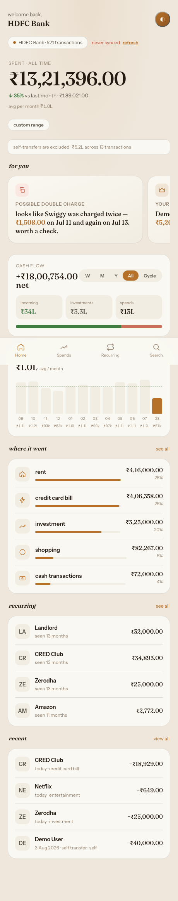
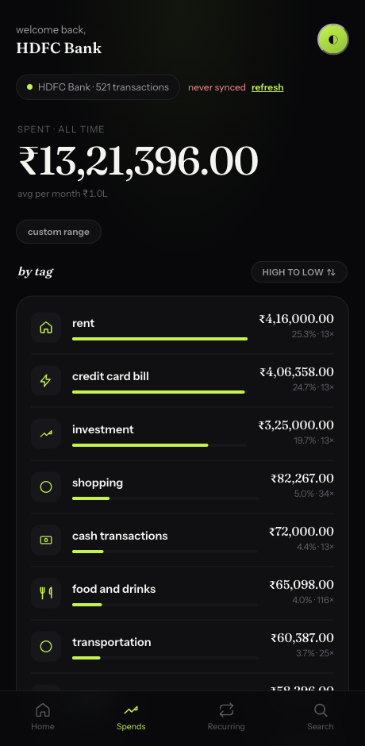
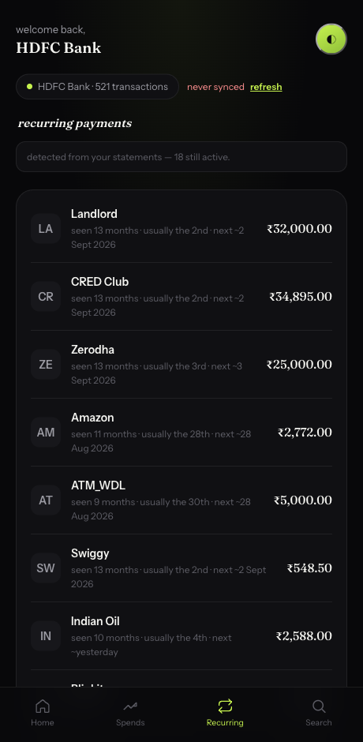
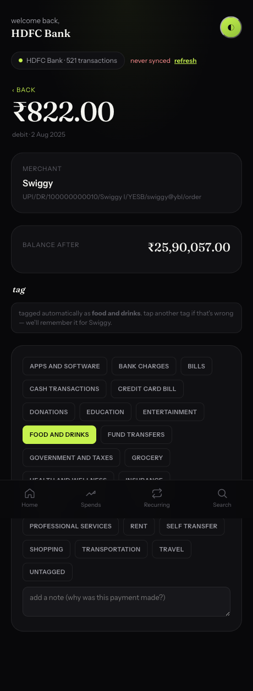

# StatementLens

**Your whole financial history, in one place, on your own machine.** Bank accounts and credit cards
together, for as many years as you have statements — not a rolling 12-month window. No cloud, no
account, no account-aggregator licence.

> Your statements, your data. Nothing is uploaded, ever. Statement passwords are derived in memory
> and never written to disk.

<p align="center">
  
  &nbsp;
  
</p>
<p align="center">
  
  &nbsp;
  
</p>
<p align="center"><em>Screenshots use synthetic demo data — regenerate with
<code>python docs/make_screenshots.py</code>.</em></p>

---

## Why

India's affluent have ~200 transactions/month scattered across banks and cards. CRED Money solves
this beautifully — via the RBI Account Aggregator framework, which needs a regulated NBFC-AA licence.
**StatementLens reaches the same "understand my money" outcome from the statements you already
receive by email**, so anyone can run it without a licence.

Three things fall out of that choice:

| | CRED Money & friends | StatementLens |
|---|---|---|
| **History** | rolling ~12-month window | **as far back as your statements go** (tested on 7+ years) |
| **Scope** | accounts the aggregator supports | **bank accounts + credit cards in one ledger** |
| **Your data** | leaves your device, sits with a regulated intermediary | **never leaves your machine** |
| **Requires** | an AA licence to build | nothing — clone and run |

The long history is the part that changes what you can ask. "Am I spending more on food than I was
two years ago?" and "what has this subscription cost me in total?" need years, not months.

## What it does

- **Reads statements from Gmail** (read-only) — PDF attachments from Indian banks/cards.
- **Unlocks password-protected PDFs** by *deriving* the password from the rule the bank states in
  its email (e.g. SBI "last 5 of mobile + DOB DDMMYY", RBL "first 4 of name CAPS + DDMMYY").
- **Parses** savings/current and credit-card layouts into a clean transaction model.
- **Categorizes** every transaction (keyword strategy; swappable for ML).
- **Surfaces insights** — the crown jewel: duplicate charges, hidden fees, spend spikes vs your own
  baseline, new recurring payments, forgotten refunds, biggest payee. Calm, second-person copy.
- **Renders** a self-contained, offline HTML dashboard — one hero number, insight cards first,
  honest cash-flow, top categories, recurring, and a searchable ledger behind a tap.

## Money math

Every monetary value is an integer number of minor units (paise) inside a `Money` value object —
**never a float.** `0.1 + 0.2` equals `0.3` exactly. The dashboard recomputes in integer paise too.

## Architecture (Ports & Adapters / Hexagonal)

The domain and use-cases depend only on **interfaces** (`domain/ports.py`); concrete Gmail / PDF /
SQLite / HTML implementations are swappable adapters. Add a bank format or a new data source by
writing an adapter — never by editing the core.

```
        ┌────────────────── use-cases ──────────────────┐
        │  IngestStatements · Analytics · Insights       │
        └───────────────┬───────────────┬────────────────┘
                        │ depends on ports (interfaces) │
   ┌────────────────────┴───────────────┴───────────────────────┐
   │ domain:  Money · Transaction · Statement · ports · (no I/O) │
   └────────────────────┬───────────────┬───────────────────────┘
                        │  implemented by adapters              │
   sources/GmailSource · crypto/PdfDecryptor · parsers/{Savings,Card}
   categorize/Keyword · persistence/SqliteRepo · render/AppShell
```

`app.py` is the composition root — the one place that wires adapters into use-cases.

## Quick start

**No Python?** Grab a build from [Releases](https://github.com/udaysrinu/StatementLens/releases),
unzip, double-click. It opens in your browser. macOS/Windows will warn once about an unidentified
developer — right-click → Open (macOS) or *More info → Run anyway* (Windows). See
[Building a release](#building-a-release).

**Have Python?**

```bash
pip install statementlens              # PDF reading is included
pip install "statementlens[gmail]"     # add the Gmail connector (IMAP needs nothing extra)
statementlens serve --account SBI
```

That's it. It opens in your browser. If you have no data yet you get a setup page — **drop your
statement PDFs on it** and the dashboard appears. Corrections you make (re-tagging a transaction,
adding a note) are saved locally and survive both a reload and a future statement refresh.

The server binds to `127.0.0.1` only and requires a per-run token, so nothing on your network — or
in another browser tab — can reach your transactions.

## Getting statements in

**The app itself has no limits.** Clone it, run it, use it — no account, no server, no quota.

| | Setup | Limit | Works with |
|---|---|---|---|
| **Drop PDFs / pick a folder** | none | none | any bank, any country |
| **Any mailbox over IMAP** | app password, ~2 min | **none** | Gmail, Outlook, Yahoo, Zoho, corporate |
| **Gmail, your own OAuth client** | ~5 min, once | none | Gmail |
| **Gmail, this build's shared client** | one click | 100 people | Gmail |

```bash
# IMAP — no Google Cloud project, no OAuth, no review queue, no cap
statementlens ingest --account HDFC --email you@gmail.com \
    --name "Your Name" --dob 12111998 --mobile 9999912345
```

The app password is read from a no-echo prompt or `STATEMENTLENS_APP_PASSWORD` — never a CLI flag,
since arguments show up in `ps` and shell history. The mailbox is opened **read-only**, so the server
itself refuses any modification and messages aren't even marked as read.

Most people should just drag their PDFs in. Banks email them monthly anyway and it takes 20 seconds.
Automation is convenience — the analysis is identical either way.

### Credit cards

Cards are the strongest case for reading statements rather than an API: a monthly card statement PDF
is **guaranteed** — issuers are required to send one — while Account Aggregator coverage for card
issuers is still patchy. Four card layouts are supported, including formats where the amount isn't
trailing (`… 5,000.00 DR 5268XXXXXXXX1234`) and where a `+` marks payments and cashbacks.

Bank accounts and cards land in **one ledger, one categorizer, one insight engine** — so a duplicate
charge or a forgotten subscription is found across all of them at once, not per-app.

### Connecting Gmail

`gmail.readonly` is a Google **restricted scope**. An OAuth client that hasn't passed a
[CASA security assessment](https://developers.google.com/workspace/guides/configure-oauth-consent)
shows an "unverified app" screen and is capped at **100 test users, each added by email address in
the Google Cloud console.** That cap is per *client*, not per user or per install — so a shared
client bundled into a public build runs out fast.

**The fix is to bring your own client, which takes five minutes and removes the cap entirely** (it's
your project, and you only need to authorise yourself):

1. [console.cloud.google.com](https://console.cloud.google.com) → new project → enable the **Gmail API**
2. **OAuth consent screen** → External → add scope `.../auth/gmail.readonly` → add your own email as
   a test user
3. **Credentials** → Create credentials → OAuth client ID → **Desktop app** → download the JSON
4. Save it as `~/.statementlens/gmail_client_secret.json`

StatementLens uses your client if that file exists, and falls back to the bundled one otherwise.
You'll still see the "unverified app" screen — that's Google telling you *your own* app is
unverified, which is fine for a tool only you use. Click *Advanced → Continue*.

Packagers can instead bake a client in at build time via `STATEMENTLENS_GOOGLE_CLIENT_ID` /
`STATEMENTLENS_GOOGLE_CLIENT_SECRET`. See `adapters/sources/bundled_client.py` for why shipping an
installed-app client secret is expected practice rather than a leak.

## CLI

```bash
# import from a folder — no Google account involved
statementlens ingest --account SBI --folder ~/Documents/Statements \
    --name "Full Name" --dob 12111998 --mobile 9999912345

# or from Gmail
statementlens ingest --account SBI --name "Full Name" --dob 12111998 --mobile 9999912345

statementlens serve  --account SBI          # browse it
statementlens render --account SBI --out out/sbi.html   # static export
statementlens stats
```

Identity hints only ever **derive** statement passwords in memory — they are never stored or sent.
`ingest` exits non-zero and explains itself if nothing was imported, so a broken import can't
masquerade as "no spending".

## Staying up to date

```bash
statementlens refresh --account SBI    # check for new statements
statementlens status                   # "updated 4 hours ago", or why not
```

The dashboard shows when it last synced and offers a refresh button, because a stale dashboard that
looks current is worse than one that admits it. Both commands **exit non-zero on failure**, so a
scheduled run surfaces a broken connector instead of hiding it.

To refresh automatically each morning (macOS):

```bash
cat > ~/Library/LaunchAgents/com.statementlens.refresh.plist <<'PLIST'
<?xml version="1.0" encoding="UTF-8"?>
<!DOCTYPE plist PUBLIC "-//Apple//DTD PLIST 1.0//EN" "http://www.apple.com/DTDs/PropertyList-1.0.dtd">
<plist version="1.0"><dict>
  <key>Label</key><string>com.statementlens.refresh</string>
  <key>ProgramArguments</key>
  <array><string>/usr/local/bin/statementlens</string><string>refresh</string>
         <string>--account</string><string>SBI</string></array>
  <key>StartCalendarInterval</key><dict><key>Hour</key><integer>9</integer></dict>
  <key>StandardErrorPath</key><string>/tmp/statementlens.err</string>
</dict></plist>
PLIST
launchctl load ~/Library/LaunchAgents/com.statementlens.refresh.plist
```

Refresh is safe to run as often as you like — content-hash dedup makes re-import a no-op, and a
minimum interval stops it from hammering Gmail.

Library use:

```python
from statementlens.app import App

# folder import — no OAuth
app = App.from_folder("~/Documents/Statements")
app.ingest(account="SBI", hints={"name": "Full Name", "dob": "12111998", "mobile": "9999912345"})
app.render("SBI", "out/sbi.html")

# fix a wrong tag; the correction outlives future re-ingests
app.correct_tag(tag="grocery", merchant="Fresh N")
```

## Building a release

```bash
./packaging/build.sh          # wheel, sdist, and a double-clickable binary
./packaging/build.sh --sign   # signed + notarized (macOS)
```

The unsigned build is **fully functional** — Gatekeeper and SmartScreen just make the user click
through a warning on first launch. Removing that warning needs credentials only the project owner can
hold:

| Platform | Needed | Cost |
|---|---|---|
| macOS | Apple Developer account → *Developer ID Application* certificate | $99/yr |
| Windows | OV or EV code-signing certificate | ~$200–500/yr |

With an Apple account, export `APPLE_SIGNING_IDENTITY`, `APPLE_ID`, `APPLE_TEAM_ID` and
`APPLE_APP_PASSWORD`, then run `--sign`; the script signs with the hardened runtime, notarizes, and
staples the ticket so the app also launches offline.

## Privacy & security

```bash
statementlens security      # shows exactly where your credentials and data live
statementlens disconnect    # forget the Gmail token
```

- **Runs entirely on your machine.** Statements are read locally; nothing is uploaded. There is no
  server, no account, and no telemetry.
- **Gmail tokens live in the OS keychain** — macOS Keychain, Windows DPAPI, or the Linux Secret
  Service — not in a file. A refresh token is a long-lived key to your whole mailbox; in a file it
  would be readable by any process running as you and copied into every backup. An existing
  plaintext token is migrated automatically on first run, and the file is deleted only after the
  keychain copy is verified. With no keychain available it falls back to a `0600` file and
  `statementlens security` **says so** rather than implying you're protected.
- **Statement passwords are derived in memory** and never written to disk or logs. The identity
  hints that derive them travel in request headers, never in a URL — a query string containing a
  date of birth ends up in browser history and any proxy log.
- **Uploaded PDFs are never persisted**: they're processed in a `0700` temp directory that is
  removed immediately after parsing. Only extracted transactions are stored.
- The local store is `~/.statementlens/store.db`, and the dashboard is served on `127.0.0.1` only,
  behind a per-run token, with `Cache-Control: no-store`.

**Not yet done, if you plan to distribute builds:** code signing and notarization. Unsigned apps are
blocked on first launch by macOS Gatekeeper and SmartScreen.

## Development

```bash
pip install -e ".[dev]"
pytest -q
```

## License

MIT — see [LICENSE](LICENSE).
